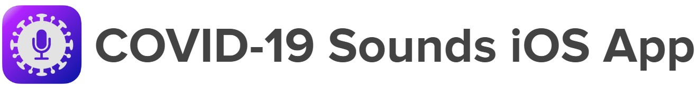

<!-- hero mark -->
<p align="center"">
  
</p>

<!-- passing marks -->

<p align="center">
  <a href="https://github.com/cam-mobsys/covid19-sounds-ios/workflows/build.yml">
    
  </a>
  <a href="https://github.com/cam-mobsys/covid19-sounds-ios/workflows/swiftlint.yml">
    
  </a>
  <a href="https://swift.org/">
    
  </a>
  <a href="https://github.com/cam-mobsys/covid19-sounds-ios/graphs/commit-activity">
    
  </a>
<p>
  
## Introduction

This application is designed to *record* and *track* COVID-19 sounds and symptoms over time; the app can then be used to participate in the study that aims to exploit respiratory sounds to detect COVID-19. 
For more details about this particular study along with its privacy policy can be found [here][2]. 
Briefly however, once installed your will be asked to a survey along with recordings of breathing, reading, and coughing sounds which are then securely uploaded to our backend for further processing.

### How you can help?

You can contribute to the fight against covid by donating your voice! Take 1 minute to report your health, and optionally opt-in to receive a notification to repeat the process every couple of days, even if you are well. 
Long-term reporting is very important, as this will help us track the evolution of your voice sounds over time. 
Every sample helps! To do so, you can get the app through the App Store following the below link:

<p align="center">
  <a href="https://apps.apple.com/gb/app/covid19-sounds/id1510614550">
    
  </a>
</p>

## Running the project

Start by cloning the `git` repository to a directory of your choice and then use `Xcode` (version > 12.0) to open `covid19-sounds-ios.xcodeproj`. 
The dependencies are installed using Swift package manager; however, please note that [SwiftLint][3] is required and needs to be installed beforehand.
To install it easily, please use [homebrew][4] as such:

```sh
brew install swiftlint
```

Optionally, if you want to generate the documentation [jazzy][12] is also required - you can install it as a `ruby` gem as such:

```sh
gem install jazzy
```

Other than these two tools, no other external dependencies are required. Please be aware that it is always recommended to use the latest macOS and `Xcode` builds 
as they become available. This version was developed and tested using macOS 11.0.1 (20B29) and `Xcode` 12.2 (12B45b).

## Notes

For security reasons some strings have been replaced; in such instances the strings values are labelled as `redacted`. 
These strings have to do with the following: 
 
 - Authentication in our backend, and
 - Cloud keys for log monitoring used by [SwiftyBeaver][21]; these are only enabled in test builds.
 
 The internal branch will be periodically be merged here as releases happen, apart from the redacted strings, everything else will be on par with the code used to build the version submitted to the App Store.

## UI Interface

The UI interface is built with [SwiftUI][5]; this was a design decision early on which let us play with a new toy but also write *significantly* cleaner code. 
However, in order your device to be able to run it natively it needs to support at least iOS 13 - from Apple's compatibility chart this includes the following devices:
 
 - iPhone 12 family (2020),
 - iPhone 11 family (2019),
 - iPhone XS and XR families (2018),
 - iPhone X, 8 and 8 Plus (2017),
 - iPhone 7 and 7 Plus (2016),
 - iPhone 6S and 6S Plus (2015),
 - iPhone SE (2016), and
 - iPod Touch, 7th generation (2019).
 
 At this time iPad targets are **not** supported at all, nor there are plans to provide support in the immediate future.
 
### Navigating through the views

The `root` view controller is [IntroductionView][6]; this will either direct you to an intro screen and then demographics survey which 
starts from [GenderView][18]. If you have completed the initial survey already and it is time to complete a survey again you will be directed to [SymptomsView][19] which will walk you through recording your symptoms at the time as well as your respiratory sounds. Finally, once finished, you will be presented with [EndView][20] which also provides an opt-in for the notification registration.

All of the views are located in the [Views][7] folder along with any subviews, styles, and utilities that were created during development; through this, hopefully, resulted in a smaller and mode modular codebase. Actually, from the initial release (v1.0), version v1.2 is half the size of actual LoC (without including the comments, which are more) and is  almost a complete rewrite. 

## Audio Recording and Playback

Audio recording is done by an instance of [AudioRecorder][8] through the [AudioRecorderViewBase][9] which is parameterised based on the recording type. 
For each screen, the audio is saved to the default user directory for the app as `breathing.m4a`, `coughing.m4a`, and `reading.m4a` for breathing, coughing, 
and reading recordings respectively. These are overwritten as soon as the user records a new sound on these screens, if in the same run, and deleted once 
they are uploaded to the server. Please note that we have different limits for the recordings for each recording type, namely:

 - breathing: 30 seconds
 - reading: 30 seconds
 - coughing: 20 seconds

Audio playback is achieved by `AudioPlayer` and offers the same functionality regardless of the recording type. 

## Location 

Location functionality is implemented in [LocationManager][10] which updates the location *once* when the user taps the grab location sample button; 
this can either be allowed once or always depending on user choice. If denied, the app will always show that the permission to gather your location was 
denied and will not collect it anymore. The location manager is passed in `SwiftUI` views as an environment object which is conforms to the 
`ObservableObject` protocol.

## Notifications

Notification functionality is located within [NotificationsManager][11]; the app will show, once the survey is completed, the option to opt-in 
for receiving prompts to complete the survey again every couple of days. If denied, the app will reflect that showing the according text but will 
not display the button nor will ask to register notifications again. 

## Documentation

Most of the classes are thoroughly documented. The format used is [`jazzy`][12] compatible and thus the latest documentation version is able to 
be generated automatically. This can be easily performed once you clone the repo through the invokation of [`make_jazzy.sh`][13] script as such:

```bash
# make the script executable (only have to do this once)
chmod +x ./make_jazzy.sh
# now run it
./make_jazzy.sh
```

The resulting documentation is generated under the `docs` directory (main file is `index.html`; it is configured to look like the Apple's native `Swift` 
documentation so it should look quite familiar. The minimum access level is `public` to avoid showing any private properties or other verbose information. 
However, if desired, this can be changed by setting the `min_acl` to `private` within [.jazzy.yml][14]. 

## Authors

The authors of this in the initial stages of the app was [@andylamp][15] as the primary contributor with [@HappiApi][16] providing occasional help; for the last few months (i.e.: post 1.0-) the sole maintainer is [@andylamp][15].

## License

This code unless otherwise stated, is governed by the terms and conditions of the [MIT License][17] a copy of which is included in the repository as well.

## Acknowledgement

If you find our paper useful or use this code, please consider citing our work as such:

```
@inproceedings{10.1145/3394486.3412865,
author = {Brown, Chlo\"{e} and Chauhan, Jagmohan and Grammenos, 
Andreas and Han, Jing and Hasthanasombat, Apinan and Spathis, 
Dimitris and Xia, Tong and Cicuta, Pietro and Mascolo, Cecilia},
title = {Exploring Automatic Diagnosis of COVID-19 from Crowdsourced Respiratory Sound Data},
year = {2020},
isbn = {9781450379984},
publisher = {Association for Computing Machinery},
address = {New York, NY, USA},
url = {https://doi.org/10.1145/3394486.3412865},
doi = {10.1145/3394486.3412865},
booktitle = {Proceedings of the 26th ACM SIGKDD International Conference on Knowledge Discovery &amp; Data Mining},
pages = {3474–3484},
numpages = {11},
keywords = {audio analysis, coughing, crowdsourcing platform, breathing, covid-19},
location = {Virtual Event, CA, USA},
series = {KDD '20}
}
```

## Disclamer

THIS SOFTWARE IS PROVIDED BY THE COPYRIGHT HOLDERS AND CONTRIBUTORS "AS IS" AND ANY EXPRESS OR IMPLIED WARRANTIES, INCLUDING, BUT NOT LIMITED TO, THE IMPLIED WARRANTIES OF MERCHANTABILITY AND FITNESS FOR A PARTICULAR PURPOSE ARE DISCLAIMED. IN NO EVENT SHALL THE COPYRIGHT OWNER OR CONTRIBUTORS BE LIABLE FOR ANY DIRECT, INDIRECT, INCIDENTAL, SPECIAL, EXEMPLARY, OR CONSEQUENTIAL DAMAGES (INCLUDING, BUT NOT LIMITED TO, PROCUREMENT OF SUBSTITUTE GOODS OR SERVICES; LOSS OF USE, DATA, OR PROFITS; OR BUSINESS INTERRUPTION) HOWEVER CAUSED AND ON ANY THEORY OF LIABILITY, WHETHER IN CONTRACT, STRICT LIABILITY, OR TORT (INCLUDING NEGLIGENCE OR OTHERWISE) ARISING IN ANY WAY OUT OF THE USE OF THIS SOFTWARE, EVEN IF ADVISED OF THE POSSIBILITY OF SUCH DAMAGE.

[1]: https://apps.apple.com/gb/app/covid19-sounds/id1510614550
[2]: https://covid-19-sounds.org
[3]: https://github.com/realm/SwiftLint
[4]: https://brew.sh/
[5]: https://developer.apple.com/xcode/swiftui/
[6]: ./covid19-sounds/Views/IntroductionView.swift
[7]: ./covid19-sounds/Views
[8]: ./covid19-sounds/Utilities/AudioRecorder.swift
[9]: ./covid19-sounds/Views/AudioRecorderViewBase.swift
[10]: ./covid19-sounds/Location/LocationManager.swift
[11]: ./covid19-sounds/Utilities/NotificationManager.swift
[12]: https://github.com/realm/jazzy
[13]: ./make_jazzy.sh
[14]: ./.jazzy.yaml
[15]: https://github.com/andylamp
[16]: https://github.com/HappiApi
[17]: ./LICENSE
[18]: ./covid19-sounds/Views/GenderView.swift
[19]: ./covid19-sounds/Views/SymptomsView.swift
[20]: ./covid19-sounds/Views/EndView.swift
[21]: https://github.com/SwiftyBeaver/SwiftyBeaver
